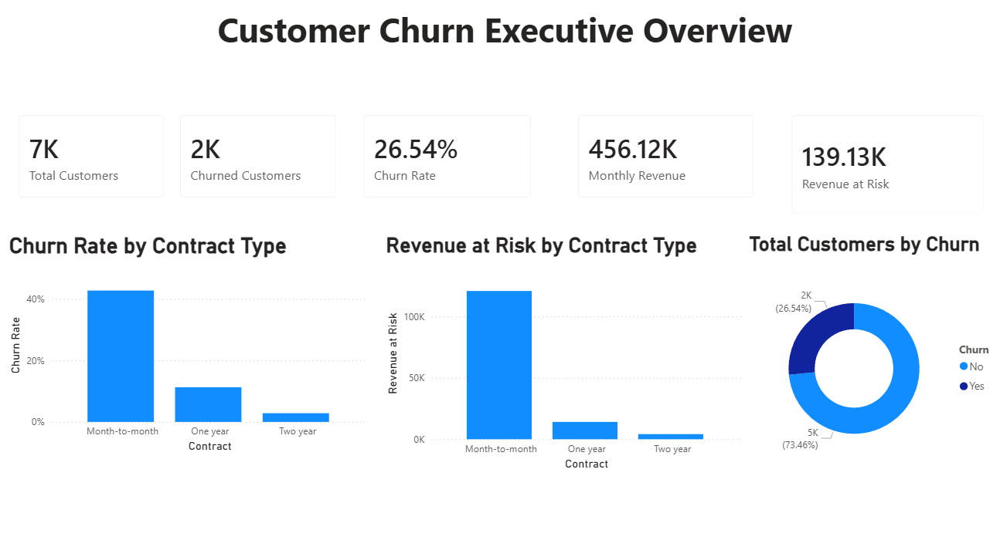
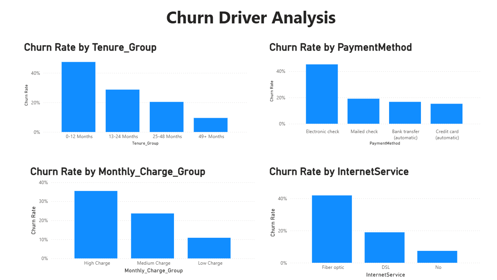
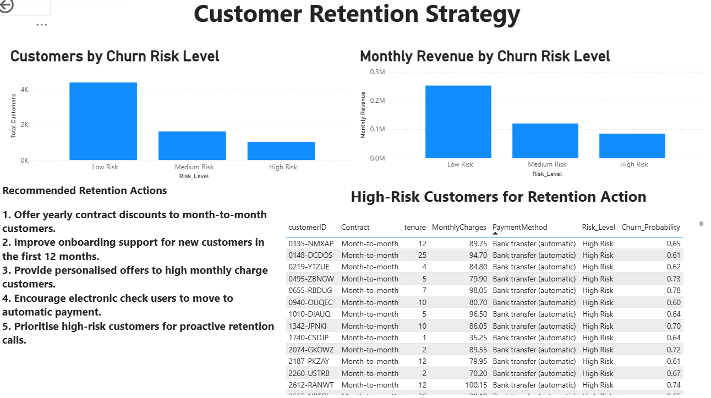

# Customer Churn Intelligence: Predicting Customer Loss and Improving Retention Strategy

## Project Overview

This project analyses customer churn for a telecom company using data science and business analytics techniques. The goal is to identify churn patterns, predict customers at risk of leaving, and recommend data-driven retention strategies to improve customer retention.

Customer churn is an important business problem because losing customers directly affects revenue, customer lifetime value, and long-term business growth.

---

## Business Problem

Telecom companies can lose customers due to contract flexibility, pricing concerns, payment methods, service experience, and low customer engagement. By identifying high-risk customers early, businesses can take proactive actions such as personalised offers, onboarding support, and retention campaigns.

This project focuses on answering:

- What is the overall churn rate?
- Which customer groups have the highest churn risk?
- How does contract type affect churn?
- Does tenure influence customer retention?
- Which payment methods are linked with higher churn?
- Can machine learning help identify high-risk customers?
- What retention actions should the business take?

---

## Project Objectives

- Analyse customer churn behaviour
- Identify key churn drivers
- Build a churn prediction model
- Create a Power BI dashboard for business users
- Recommend retention strategies to reduce churn

---

## Dataset

The project uses a telecom customer churn dataset containing customer demographic, account, service, billing, contract, and churn-related information.

Key fields include:

- `customerID`
- `gender`
- `SeniorCitizen`
- `tenure`
- `Contract`
- `PaymentMethod`
- `MonthlyCharges`
- `TotalCharges`
- `Churn`

The target variable is `Churn`, which indicates whether a customer left the company.

---

## Tools and Technologies

- Python
- Pandas
- NumPy
- Matplotlib
- Scikit-learn
- SQL
- Power BI
- Excel
- GitHub

---

## Project Methodology

The project followed a structured analytics workflow:

1. Data understanding
2. Data cleaning
3. Feature engineering
4. Exploratory data analysis
5. SQL business analysis
6. Predictive modelling
7. Power BI dashboard development
8. Business recommendations

---

## Data Cleaning and Feature Engineering

The dataset was cleaned and prepared for analysis. The `TotalCharges` column was converted from text to numeric format because it was required for analysis and modelling.

New features were created:

- `Churn_Flag`: Converts churn into numeric format, where Yes = 1 and No = 0
- `Tenure_Group`: Groups customers based on tenure
- `Monthly_Charge_Group`: Groups customers based on monthly charges
- `Churn_Probability`: Predicted churn probability from the model
- `Risk_Level`: Groups customers into Low Risk, Medium Risk, and High Risk categories

---

## Key Business KPIs

| Metric | Value |
|---|---:|
| Total Customers | 7,043 |
| Churned Customers | 1,869 |
| Churn Rate | 26.54% |
| Monthly Revenue | 456.12K |
| Revenue at Risk | 139.13K |

The churn rate of 26.54% shows that approximately one in four customers left the company, indicating a significant customer retention challenge.

---

## Exploratory Data Analysis Findings

The analysis showed that customer churn is strongly linked with contract type, tenure, payment method, internet service, and monthly charges.

Key findings:

- Month-to-month customers had the highest churn rate.
- Customers in the first 12 months showed the highest churn risk.
- Electronic check users had higher churn compared to other payment methods.
- High monthly charge customers were more likely to churn.
- Fiber optic customers showed higher churn compared to DSL and no internet service groups.
- Customers on longer-term contracts showed lower churn risk.

---

## Machine Learning Model

Two machine learning models were tested:

- Logistic Regression
- Random Forest

The models were evaluated using:

- Accuracy
- Precision
- Recall
- F1-score

Logistic Regression performed better overall and was selected as the final model.

### Model Performance

| Model | Accuracy | Precision | Recall | F1 Score |
|---|---:|---:|---:|---:|
| Logistic Regression | 0.7991 | 0.6522 | 0.5214 | 0.5795 |
| Random Forest | 0.7842 | 0.6215 | 0.4786 | 0.5408 |

For churn prediction, recall is important because the business wants to identify customers who are likely to leave before they actually churn. Missing a high-risk customer may result in losing the opportunity to take retention action.

---

## Power BI Dashboard

The Power BI dashboard contains three pages:

### 1. Executive Overview

This page shows the overall churn situation using KPI cards and visual summaries.

Includes:

- Total customers
- Churned customers
- Churn rate
- Monthly revenue
- Revenue at risk
- Churn rate by contract type
- Revenue at risk by contract type
- Customer churn distribution

### 2. Churn Driver Analysis

This page identifies the main factors linked with churn.

Includes:

- Churn rate by tenure group
- Churn rate by payment method
- Churn rate by internet service
- Churn rate by monthly charge group

### 3. Retention Strategy

This page supports business action by identifying high-risk customers and recommended retention strategies.

Includes:

- Customers by churn risk level
- Monthly revenue by churn risk level
- High-risk customer table
- Recommended retention actions

---

## Dashboard Screenshots

### Executive Overview



### Churn Driver Analysis



### Retention Strategy



---

## SQL Analysis

SQL was used to extract important business insights such as total customers, churn rate, churn by contract type, churn by payment method, churn by tenure group, revenue at risk, and high-risk customer identification.

Example SQL analysis included:

- Total customers
- Overall churn rate
- Churn by contract type
- Churn by payment method
- Churn by tenure group
- Revenue at risk by contract type
- High-risk customer list

---

## Business Recommendations

Based on the analysis, the following actions are recommended:

1. Offer yearly contract discounts to month-to-month customers.
2. Improve onboarding support for customers in their first 12 months.
3. Provide personalised offers to high monthly charge customers.
4. Encourage electronic check users to move to automatic payment methods.
5. Prioritise high-risk customers for proactive retention calls.

These actions can help the business reduce churn, protect revenue, and improve customer loyalty.

---

## Project Files

```text
customer-churn-intelligence
│
├── data
│   ├── raw
│   └── processed
│
├── images
│   ├── dashboard_executive_overview.png
│   ├── dashboard_churn_driver_analysis.png
│   └── dashboard_retention_strategy.png
│
├── notebooks
│   └── customer_churn_analysis.ipynb
│
├── powerbi
│   └── customer_churn_dashboard.pbix
│
├── report
│   └── customer_churn_case_study.pdf
│
├── sql
│   └── churn_business_queries.sql
│
└── README.md
